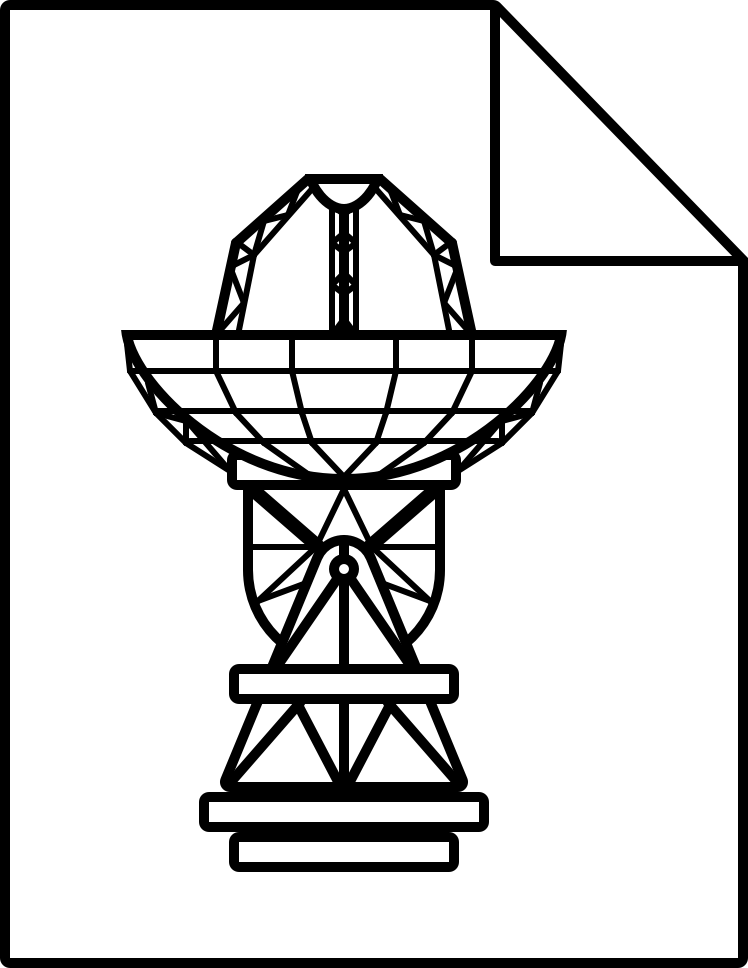

# VDIF Parse

> :warning: **WARNING**: This project is in early development and is not yet suitable for public use. **This repo is public for feedback purposes only.**

A simple C library for parsing and manipulating stream- or file-based radio telescope data in **VDIF**[^1] or **CODIF**[^2] formats.

[^1]: VLBI Data Interchange Format (source: [vlbi.org](https://vlbi.org/wp-content/uploads/2019/03/VDIF_specification_Release_1.1.1.pdf))
[^2]: CSIRO Oversampled Data Interchange Format (source: CSIRO internal)

## Usage

VDIFparse can be given data to parse in either of two ways: 

* **from streamed or piped input** (`StreamMode`), or 
* **from a file** (`FileMode`). 

These loosely correlate with the two ways a user is likely to interact with VDIF data: **live** (as data comes in from a telescope or similar source) or **later** (on historical data at rest).

**Data Input**

```c
// OPTION A: StreamMode (open a data sink to buffer data into)
struct DataStream ds = open_sink();
// TODO: stream data in

// (do your work)
close(&ds);

// OPTION B: FileMode (open a file to read from)
struct DataStream ds = open_file("gre53_ef_scan035_fd1024-16-2-16.vdif");
// ds has now parsed first header for basic stream attributes

// (do your work)
close(&ds);
```

**Configuration**

```c
// TODO: set thread attributes
set_thread_attributes(&ds, 0, 1414.0, 16, "Ch01");
// 0 = thread number
// 1414.0 = radio frequency (MHz)
// 16 = bandwidth (MHz)
// "Ch01" = name of the signal

// configure whether to skip or include data gaps
set_gap_policy(&ds, InsertInvalid);

// TODO: output thread selection

// TODO: seek to timestamp
```

**Data Processing and Output**

```c
// output raw data (such as to a new file)
read_frames(ds, num_frames_to_read, output_buffer);

// decode and output data (such as for input to a software spectrometer)
decode_samples(ds, num_samples_to_read, output_buffer, valid_samples);

// maybe check how much bad data was found in the process
for (int channel = 0; channel < num_channels; channel++) {
    // because we set up the stream to included invalid samples, 
    // it's easy to see how much invalid data was found
    int bad_samples = num_samples_to_read - valid_samples[channel];
    if (bad_samples > 0) {
        fprintf(stderr, "Bad data in output channel %d :", channel);
        fprintf(stderr, "%d samples\n", bad_samples);
    }
}

// TODO: fanning multi-thread input into multiple single-thread outputs?
```

**Data Inspection**

```c
// inspect fields that remain static in a DataStream
uint8 header_length = ds->header_length;

// inspect fields that remain static in a DataThread
uint32 num_channels = ds->thread[thread_id]->num_channels;

// inspect fields that are specific to a channel within a DataThread
float frequency = ds->thread[thread_id]->channels[channel_num].frequency;

// inspect fields that are specific to a DataFrame within a DataStream
// TODO
```

## Limitations

* File input must begin with a valid header, beginning at bit 0.
* Limit to the number of channels per stream: 2<sup>16</sup> (65,536) instead of theoretical 2<sup>31</sup> (2,147,483,648)

## License

This project is licensed under the terms of the [GNU General Public License, version 3](https://www.gnu.org/licenses/gpl-3.0.en.html). **This is a [copyleft](https://www.gnu.org/licenses/copyleft.en.html) license.**
